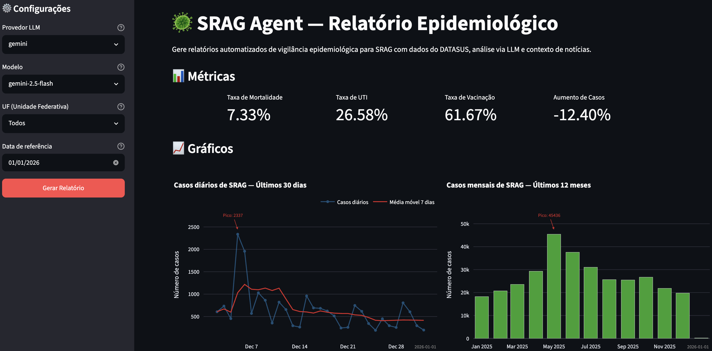
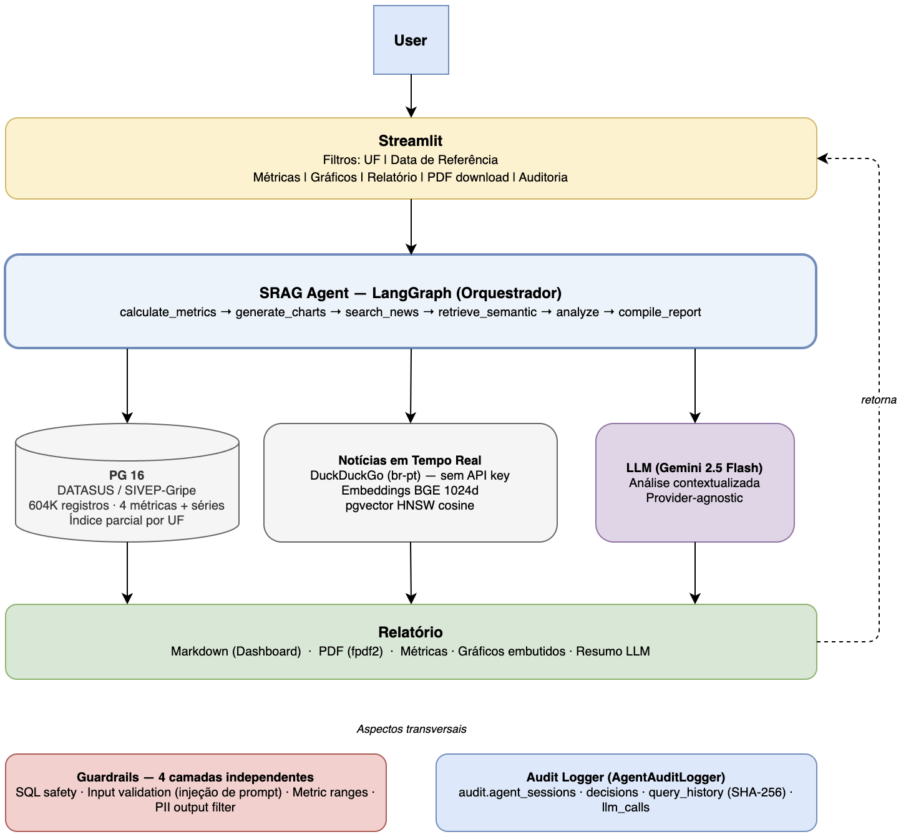
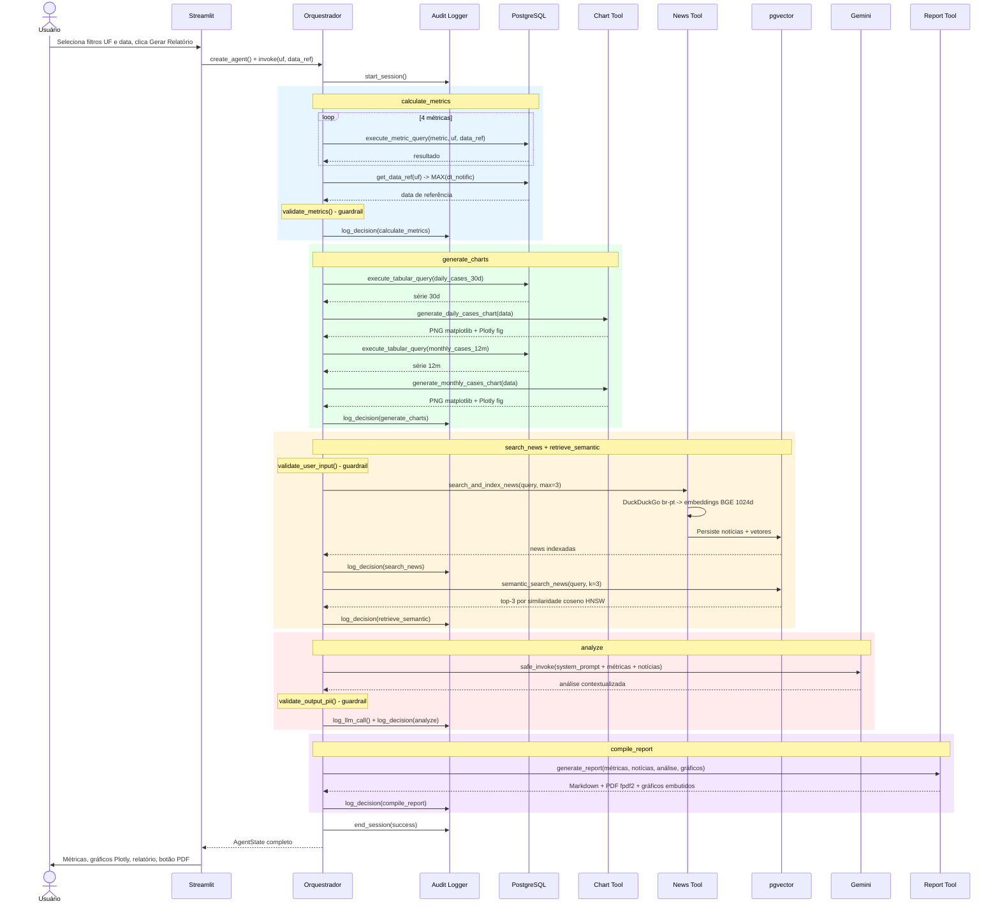
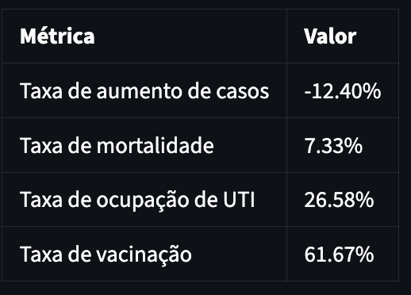
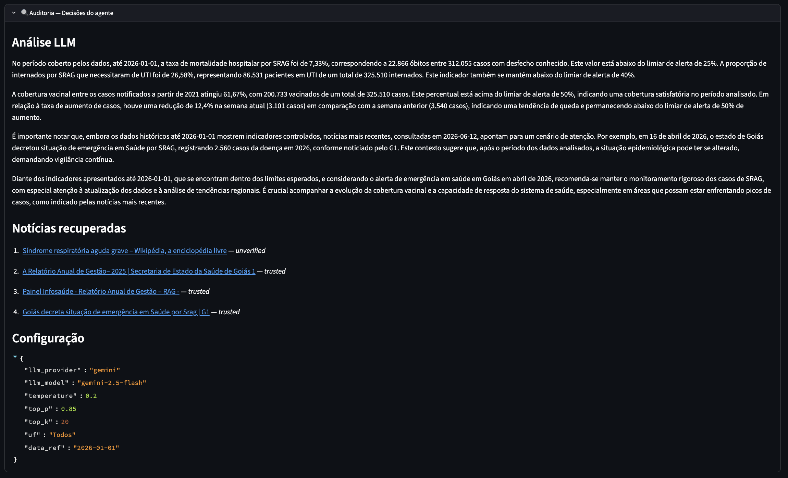

# SRAG AI Agent


Agente de IA para análise epidemiológica automatizada de SRAG (Síndrome Respiratória Aguda Grave). Combina dados históricos do DATASUS com busca de notícias em tempo real e análise via LLM para gerar relatórios estruturados — métricas, gráficos, resumo e PDF — em uma única execução orquestrada pelo LangGraph.


_Dashboard Streamlit com métricas epidemiológicas, gráficos de tendência, relatório gerado por LLM e painel de auditoria_

---

## Contexto

A **Indicium HealthCare Inc.** precisa de uma solução capaz de dar a profissionais de saúde um entendimento em tempo real da severidade e avanço de surtos de doenças. Esta PoC atende ao requisito com dados reais do **SIVEP-Gripe (Open DATASUS)** — 604.230 internações por SRAG de 2023 a 2026 — cruzados com notícias recentes buscadas pelo agente a cada execução.

O escopo cobre exatamente o que foi requisitado: quatro métricas epidemiológicas (aumento de casos, mortalidade, UTI, vacinação), dois gráficos (diário 30d e mensal 12m), análise contextualizada por LLM e exportação do relatório em PDF.

---

## Arquitetura


_Diagrama gerado em draw.io & PDF — fontes em `docs/diagrams/architecture_macro.drawio`, `docs/pdfs/architecture_full.pdf` e `docs/pdfs/architecture_macro.pdf`_

O agente segue um **fluxo sequencial de 6 nós** implementado como `StateGraph` do LangGraph. O estado (`AgentState`) é tipado e propagado integralmente entre os nós — cada etapa lê o que precisa do estado e publica o resultado de volta nele.

O diagrama abaixo detalha as interações entre todos os componentes a cada execução:



_Guardrails atuam em três pontos independentes: `validate_user_input` (injeção de prompt), `validate_metrics` (intervalos biológicos) e `validate_output_pii` (mascaramento no output do LLM). O `AgentAuditLogger` registra cada decisão nas tabelas `audit.*`._

| Nó | Ferramenta | O que faz |
|----|-----------|-----------|
| `calculate_metrics` | SQL Tool | 4 métricas + 2 séries temporais via queries parametrizadas (`data_ref` + `:uf`) |
| `generate_charts` | Chart Tool | Gráfico diário (30d) e mensal (12m) com média móvel 7d e anotação do pico |
| `search_news` | News Tool | Busca no DuckDuckGo (`br-pt`), gera embeddings BGE e persiste em pgvector |
| `retrieve_semantic` | Embeddings Service | RAG: recupera as notícias mais relevantes por similaridade coseno (HNSW) |
| `analyze` | LLM Adapter | LLM analisa métricas + notícias recuperadas; `temperature=0.2` para resposta factual |
| `compile_report` | Report Tool | Combina tudo em Markdown e PDF (fpdf2) |

Dois aspectos transversais cobrem todos os nós: **Guardrails** (4 camadas de proteção) e **Audit Logger** (registro completo de decisões, queries e chamadas LLM).

---

## Stack Tecnológica

| Ferramenta | Versão | Propósito | Justificativa |
|-----------|---------|-----------|---------------|
| Python | 3.11+ | Linguagem principal | Ecossistema rico para dados e IA |
| PostgreSQL + pgvector | 16 | Banco de dados + busca vetorial | SQL e embeddings no mesmo serviço — sem Chroma/Weaviate separado |
| LangGraph | ~1.2 | Orquestração do agente | Fluxo sequencial com estado tipado; mais simples que agentes com branching |
| LangChain | ~1.3 | Framework LLM | Provider-agnostic; troca de Gemini por Groq/Ollama sem mudar código |
| Gemini 2.5 Flash | — | LLM principal | Custo-benefício, tool calling estável, free tier para desenvolvimento |
| HuggingFace BGE | bge-large-en-v1.5 | Embeddings 1024d | Boa qualidade para recuperação semântica; roda localmente (sem API key) |
| DuckDuckGo (`ddgs`) | ~9.14 | Busca de notícias | Gratuito, sem API key; termo regionalizado por UF |
| Plotly + kaleido | ~6.8 / <1.0 | Gráficos | Interativo no Streamlit; PNG headless no container (`kaleido<1.0` para export estável) |
| fpdf2 | ~2.8 | Geração de PDF | Leve, suporte UTF-8, sem dependências externas |
| Streamlit | ~1.58 | Interface web | Dashboard responsivo com filtros, métricas, gráficos e auditoria |
| SQLAlchemy | ~2.0 | ORM e queries | Gerenciamento de schema + índices; garantia de integridade no seed |
| Pydantic v2 | ~2.13 | Configuração | Validação de settings com `.env`; falha rápido em variáveis ausentes |

---

## Dados

### Fonte

Dados de internações por SRAG do DATASUS/SIVEP-Gripe, baixados diretamente do S3 público:

- **URL**: `https://s3.sa-east-1.amazonaws.com/ckan.saude.gov.br/SRAG/`
- **Período**: 2023–2026
- **Volume carregado**: 604.230 registros (após limpeza)
- **Colunas originais**: ~100 — retidas 20 pertinentes (epidemiológicas, clínicas, demográficas)

### Limpeza e privacidade

PII é tratado em duas camadas — **remoção no ETL** e **mascaramento no output**:

- Colunas PII (`NM_PACIENT`, `NU_CPF`, `NU_CNS`, `NM_MAE_PAC`, `END_*`) nunca são armazenadas no banco
- Dados demográficos retidos apenas em nível agregado (idade em anos, sem localização exata)
- Conformidade com LGPD; detalhes em [`docs/data_privacy.md`](docs/data_privacy.md)
- Guardrail de output mascara CPF, telefone e email que eventualmente apareçam na resposta do LLM

O CSV original apresenta ~0,18% de duplicatas e registros com `dt_notific` nula; ambos são descartados no ETL (`src/data/etl.py`).

### Temporalidade

- **Métricas e gráficos** derivam dos dados históricos do DATASUS — a data de referência é `MAX(dt_notific)` do escopo selecionado (Brasil ou UF), não `NOW()`. DATASUS tem atraso de notificação; usar `NOW()` geraria "0 casos" nas últimas semanas.
- **Notícias** são buscadas em tempo real a cada execução.

Esta distinção é explicitada no relatório gerado e nos prompts do LLM.

---

## Métricas



_Indicadores epidemiológicos do dashboard_

| Métrica | Fórmula | Observação |
|---------|---------|------------|
| Taxa de aumento de casos | `(casos_semana_atual − casos_semana_anterior) / casos_semana_anterior × 100` | Semana a semana; mostra variação absoluta quando semana anterior = 0 |
| Taxa de mortalidade | `óbitos SRAG / total com desfecho × 100` | Apenas casos com evolução 1, 2 ou 3 |
| Taxa de UTI | `internados em UTI / total internados × 100` | Proporção internados → UTI, não ocupação de leitos |
| Taxa de vacinação | `vacinados / total de casos × 100` | A partir de 2021 (início da vacinação COVID) |

> **Nota:** A taxa de UTI mede quem *foi* para UTI, não ocupação de leitos. O SIVEP-Gripe não registra leitos disponíveis.

> **Nota:** Perto do `MAX(dt_notific)`, os dados são esparsos por atraso de notificação. Quando a semana anterior tem 0 casos, a interface exibe a **variação absoluta** (`+127 casos`) em vez de percentual inválido.

---

## Guardrails e Privacidade

O agente implementa 4 camadas de proteção independentes:

1. **SQL safety** — keywords destrutivos bloqueados (`DROP`, `DELETE`, `ALTER`, etc.), multi-statement bloqueado, `SELECT *` sem `WHERE` bloqueado, `LIMIT` automático (padrão 1000). Todas as queries são logadas em `audit.query_history` com hash SHA-256.

2. **Validação de input** — máximo 1000 caracteres, detecção de injeção de prompt com 7 padrões em PT e EN (ex.: "ignore suas instruções anteriores", "act as if you are"). Conteúdo de notícias via DuckDuckGo é uma superfície de ataque potencial — este guardrail cobre esse vetor.

3. **Validação de métricas** — alertas automáticos para valores biologicamente implausíveis: mortalidade >50%, UTI >100%, vacinação >100%, aumento >500%. O SRAG data tem problemas de preenchimento; anomalias precisam ser sinalizadas antes de chegar ao LLM.

4. **Filtro de PII no output** — mascaramento de CPF (formato e raw 11 dígitos), telefone `(XX) XXXXX-XXXX` e email com regex. Defesa em profundidade: mesmo que PII escape do ETL, o output está protegido.

---

## Resumo, Observabilidade & Auditoria


_Painel de auditoria mostrando o resumo da análise feito pela LLM, notícias recuperadas e configuração da execução_

O `AgentAuditLogger` registra cada execução em 4 tabelas PostgreSQL no schema `audit.*`:

| Tabela | Conteúdo |
|--------|----------|
| `audit.agent_sessions` | Início, fim, status e duração total da sessão |
| `audit.agent_decisions` | Cada tool call: step, ferramenta, input/output resumido, duração, sucesso |
| `audit.query_history` | Texto e hash SHA-256 de toda query SQL executada, tempo, se foi bloqueada |
| `audit.llm_calls` | Prompt hash, tokens de entrada/saída, provider, modelo, duração |

Além do banco, o logger emite um **trace verboso** no console e em arquivo rotativo diário (`data/logs/srag_agent.log`) com três tipos de evento: `[tool-call]`, `[llm-call]` e `[sql]`. O trace mostra o fluxo completo do agente passo a passo.

O expander **"Auditoria — Decisões do agente"** na UI exibe a análise LLM, as notícias recuperadas e a configuração completa (provider, modelo, parâmetros de sampling).

---

## Início Rápido

### Pré-requisitos

- Python 3.11+
- Docker e Docker Compose
- Chave de API do Google (Gemini) — ou outro provider LLM

### Instalação

```bash
# 1. Clone o repositório
git clone https://github.com/yurioliveira3/ai_engineer_cert_ind.git
cd ai_engineer_cert_ind

# 2. Configure o .env
cp .env.example .env
# Edite .env e adicione LLM_API_KEY (Gemini) ou GOOGLE_API_KEY

# 3. Suba o PostgreSQL com pgvector
docker compose up -d srag-db

# 4. Instale as dependências de desenvolvimento
pip install -r requirements-dev.txt

# 5. Baixe os dados do DATASUS
python scripts/download_srag_data.py --all

# 6. Carregue os dados no banco
python scripts/seed_db.py

# 7. Valide os dados
python scripts/validate_data.py

# 8. Teste a conectividade LLM
python scripts/test_llm.py

# 9. Suba a aplicação completa
docker compose up -d
# Acesse: http://localhost:8501
```

### Alternativas sem Docker

```bash
# CLI (sem UI)
python scripts/run_agent.py

# UI local
streamlit run src/ui/app.py
```

### Operações Docker

**Rebuild só do app** (banco e dados preservados):
```bash
docker compose stop srag-app
docker compose build --no-cache srag-app
docker compose up -d srag-app
```

**Reset completo** (apaga banco — exige re-seed):
```bash
docker compose down -v
docker compose build --no-cache
docker compose up -d
python scripts/seed_db.py
```

> ⚠️ `down -v` apaga o volume `srag-pgdata`. Todos os dados do PostgreSQL são perdidos.

### Configuração (`.env`)

| Variável | Padrão | Descrição |
|----------|--------|-----------|
| `POSTGRES_USER` | `srag_app` | Usuário do PostgreSQL |
| `POSTGRES_PASSWORD` | `srag_pass` | Senha do PostgreSQL |
| `POSTGRES_DB` | `srag` | Nome do banco |
| `POSTGRES_PORT` | `5433` | Porta local (5433 evita conflito com instância local) |
| `DATABASE_URL` | construído | URL completa — sobrescreve as variáveis acima se definido |
| `LLM_PROVIDER` | `gemini` | Provider LLM (`gemini`, `openrouter`, `groq`, `ollama`) |
| `LLM_MODEL` | `gemini-2.5-flash` | Modelo LLM |
| `LLM_API_KEY` | — | Chave de API do provider |
| `LLM_BASE_URL` | — | URL base para providers OpenAI-compatible |
| `GOOGLE_API_KEY` | — | Alternativa à `LLM_API_KEY` para Gemini |
| `EMBEDDING_MODEL` | `BAAI/bge-large-en-v1.5` | Modelo HuggingFace para embeddings |
| `EMBEDDING_DIM` | `1024` | Dimensão dos embeddings |
| `LOG_LEVEL` | `INFO` | Nível de log (`DEBUG` para trace completo) |
| `NEWS_MAX_SEARCHES` | `3` | Buscas de notícias por execução (guardrail limita a 5) |

---

## Filtros e Parâmetros

A sidebar do Streamlit oferece dois filtros propagados de ponta a ponta (UI → estado do agente → queries SQL → termo de busca de notícias):

- **UF**: filtra por estado de notificação (`sg_uf_not`). `Todos` = Brasil inteiro. Regionaliza também o termo de busca no DuckDuckGo (ex.: `SRAG São Paulo epidemiologia`).
- **Data de referência**: quando vazia, usa `MAX(dt_notific)` do escopo selecionado. Quando preenchida, reposiciona todas as janelas temporais das queries.

### Parâmetros do LLM

Calibrados para análise factual e ancorada em dados — não geração criativa:

| Parâmetro | Valor | Razão |
|-----------|-------|-------|
| `temperature` | `0.2` | Resposta determinística, próxima aos dados |
| `top_p` | `0.85` | Nucleus sampling reduzido |
| `top_k` | `20` | Apenas Gemini; restringe o vocabulário de escolha |

Os parâmetros são registrados no expander de auditoria da UI via `get_sampling_params`.

---

## Testes e Qualidade

```bash
# Testes unitários (sem banco/CSV reais) — cobertura medida por padrão
pytest tests/ -m "not integration"

# Testes de integração (banco populado + CSV em data/raw/)
pytest tests/ -m integration

# Lint e formatação
ruff check src/ tests/ scripts/
ruff format --check src/ tests/ scripts/

# Type checking
mypy src/
```

**Resultados:** 129 testes unitários + 19 de integração = **148 total**; cobertura unitária **80,44%** (budget `fail_under = 75`); ruff limpo (regras E, F, I, N, W, UP, B, SIM, T20, RUF); mypy sem erros.

O budget de cobertura (`--cov-fail-under`) é configurado em `pyproject.toml` e o CI falha se a suíte unitária cair abaixo de 75%. Módulos que dependem de banco/modelo (`sql_tool`, `embeddings`) são cobertos pela suíte de integração. UI Streamlit e o model declarativo são excluídos da medição.

---

## Estrutura do Projeto

```
srag-agent/
├── docker-compose.yml          # PostgreSQL + pgvector (porta 5433)
├── Dockerfile                  # Container da aplicação (porta 8501)
├── requirements.txt            # Dependências de runtime
├── requirements-dev.txt        # pytest, ruff, mypy (não entram no container)
├── pyproject.toml              # ruff, pytest, coverage+budget, mypy
├── .env.example                # Template de variáveis de ambiente
├── db/init-scripts/            # 5 scripts SQL executados na criação do banco
│   ├── 01_schemas.sql         # Schemas: srag, news, audit
│   ├── 02_lang_setup.sql      # Extensão pgvector
│   ├── 03_app_user.sql        # Role srag_app com grants mínimos
│   ├── 04_audit.sql           # 4 tabelas de auditoria
│   └── 05_news.sql            # news_embeddings com índice HNSW (cosine)
├── src/
│   ├── config.py              # Settings (Pydantic BaseSettings)
│   ├── llm/
│   │   ├── adapter.py         # get_chat_model, safe_invoke, get_token_usage, retry
│   │   └── providers.py       # Providers + sampling factual, get_sampling_params
│   ├── data/
│   │   ├── etl.py             # CSV load, clean, remoção de PII, labels
│   │   ├── models.py          # SragCase SQLAlchemy — índices composto + parcial UF
│   │   ├── queries.py         # 6 SQL templates parametrizados (data_ref + :uf)
│   │   └── embeddings.py      # EmbeddingsService + NewsEmbeddingsRepository
│   ├── agent/
│   │   ├── orchestrator.py    # LangGraph StateGraph; filtros UF/data; setup logging
│   │   ├── guardrails.py      # SQL safety, input/output validation, PII filter
│   │   ├── logging_config.py  # AgentAuditLogger (trace verboso), setup_logger
│   │   ├── prompts/
│   │   │   ├── system.txt     # System prompt (papel, anti-alucinação, tom)
│   │   │   └── analyze_metrics.txt  # User prompt (tarefa + dados + few-shot)
│   │   └── tools/
│   │       ├── sql_tool.py     # execute_metric_query, execute_tabular_query, get_data_ref
│   │       ├── news_tool.py    # search_and_index_news, semantic_search_news
│   │       ├── chart_tool.py   # generate_daily/monthly_cases_chart
│   │       └── report_tool.py  # generate_report (markdown + PDF), metric_value_parts
│   └── ui/
│       └── app.py             # Dashboard Streamlit: filtros, métricas, gráficos, auditoria
├── tests/                      # 12 arquivos, 148 testes (129 unitários + 19 integração)
├── scripts/
│   ├── download_srag_data.py  # Download CSVs do DATASUS S3
│   ├── seed_db.py             # Carga no PostgreSQL (DROP + create_all + append)
│   ├── validate_data.py       # Sanity checks pós-seed
│   ├── explore_data.py        # Exploração exploratória de dados
│   ├── test_llm.py            # Validação de conectividade LLM
│   └── run_agent.py           # CLI runner do agente
└── docs/
    ├── diagrams/
    │   └── architecture.drawio # Diagrama conceitual — abrir no draw.io e exportar PDF
    ├── screenshots/            # Prints da UI para o README (adicionar manualmente)
    ├── data_privacy.md         # Decisões PII/LGPD
    └── metrics_validation.md   # Validação cruzada das métricas
```

---

## Decisões de Design

Decisões não-óbvias que afetam o comportamento do sistema:

**pgvector no mesmo PostgreSQL**
Embeddings de notícias e dados SRAG vivem no mesmo banco. Evita um serviço separado (Chroma, Weaviate) no Docker Compose, simplificando o deploy da PoC sem perda de funcionalidade.

**HNSW em vez de IVFFlat**
O script `05_news.sql` roda na inicialização do container, com a tabela `news.news_embeddings` vazia. IVFFlat exige dados para calcular centróides — criado sem dados, é ignorado pelo planner. HNSW constrói progressivamente conforme linhas são inseridas e funciona corretamente desde o início.

**Índice parcial `idx_srag_confirmed_dt_uf`**
Todas as 6 queries filtram `caso_confirmado = true`. O índice `(dt_notific, sg_uf_not) WHERE caso_confirmado = true` é menor que um índice completo e cobre queries com filtro de UF em uma única varredura, sem combinar dois índices separados.

**`to_sql("replace")` é uma armadilha**
`pandas.to_sql(if_exists="replace")` faz `DROP TABLE + CREATE TABLE` usando DDL próprio do pandas — destrói todos os índices gerenciados pelo SQLAlchemy silenciosamente. O `scripts/seed_db.py` usa `DROP TABLE IF EXISTS + Base.metadata.create_all() + to_sql("append")` para garantir que o schema (incluindo índices) seja sempre recriado corretamente.

**`data_ref = MAX(dt_notific)`, não `NOW()`**
O DATASUS tem atraso de notificação. Se a data de referência fosse `NOW()`, as últimas semanas apareceriam com 0 casos (ainda não notificados), gerando análise enganosa. Usar o máximo real do dataset ancora a análise à última data com dados disponíveis.

**LLM provider-agnostic**
O `LLMAdapter` abstrai sobre Gemini, OpenRouter, Groq e Ollama. System prompt e user prompt são sempre separados — nunca concatenados em uma única string. O nó `analyze` passa o mesmo objeto independente do provider.

**`temperature=0.2`**
A tarefa do LLM é análise factual ancorada em dados e notícias fornecidos — não geração criativa. Temperatura baixa + nucleus sampling reduzido (`top_p=0.85`) minimiza alucinação e mantém a resposta próxima ao contexto fornecido.

---

## Critérios de Avaliação

Mapeamento explícito dos critérios da atividade para a implementação:

| Critério | Implementação |
|----------|--------------|
| **Arquitetura** | LangGraph `StateGraph` com 6 nós sequenciais; `AgentState` tipado como único canal de dados; tools desacopladas e testáveis; Docker Compose com dois serviços |
| **Governança e Transparência** | `AgentAuditLogger`: 4 tabelas `audit.*` + log rotativo; trace `[tool-call]` / `[llm-call]` / `[sql]` por execução; expander de auditoria na UI |
| **Guardrails** | SQL safety, validação de input (injeção de prompt), validação de métricas (ranges), filtro de PII no output — 4 camadas independentes |
| **Tratamento de Dados Sensíveis** | PII removido no ETL (nunca armazenado); mascaramento regex no output do LLM; conformidade LGPD documentada em `docs/data_privacy.md` |
| **Clean Code** | Type hints completos; Pydantic para config; ruff (E, F, I, N, W, UP, B, SIM, T20, RUF); mypy sem erros; 80%+ cobertura; sem dead code |

---

## Melhorias Futuras

| Prioridade | Item | Descrição |
|-----------|------|-----------|
| Alta | Cache de buscas | Evitar buscar notícias repetidas em execuções seguidas |
| Alta | Fallback Tavily | Busca de notícias quando DuckDuckGo falha ou retorna poucos resultados |
| Média | Multi-agente | Arquitetura com especialistas (epidemiologista, vacinólogo) e orquestrador |
| Média | Embeddings multilingual | Avaliar `BAAI/bge-m3` para melhor busca semântica em PT-BR |
| Baixa | Download automático | Agendamento de atualização dos dados SRAG |
| Baixa | PDF customizado | Layout com tabelas e gráficos embutidos, não só texto |

---

## Licença

Projeto acadêmico para certificação de AI Engineer. Dados públicos do DATASUS (Portaria GM/MS Nº 1.119/2022).
